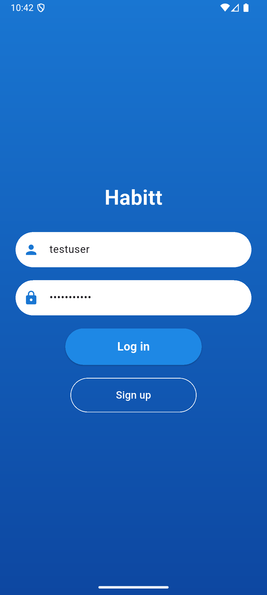
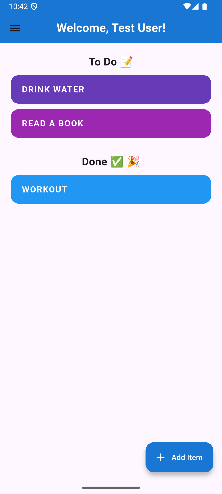
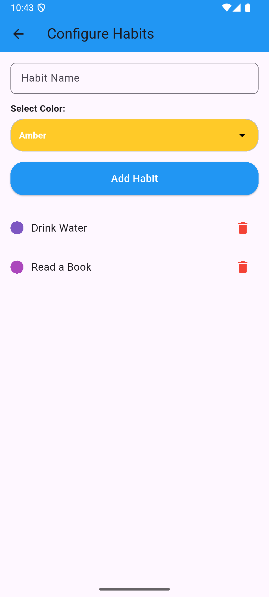
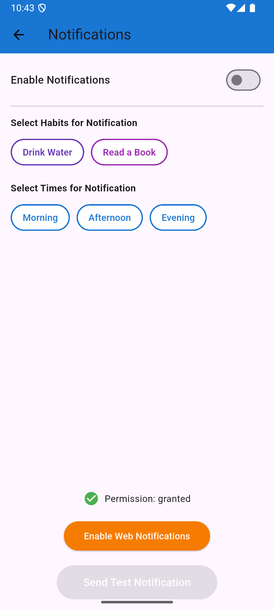

# Time Habit Tracker - Marketplace Listing

## 📱 App Details
- **Name**: Time Habit Tracker  
- **Short Description**: Track and improve your habits daily.  
- **Full Description**:  
  Time Habit Tracker is a user-friendly app that helps you build positive habits and track progress. Stay motivated with daily reminders, weekly reports, and a visually appealing design. Ideal for anyone looking to improve their productivity and well-being.

---

## 🔑 Keywords
Habit, Productivity, Tracker, Self-improvement, Daily habits

---

## 🖼️ Media Assets

### App Icon

### Screenshots
1.   
2.   
3.   
4.   
5.   

---

## 🎬 Promotional Video
[▶️ Watch on YouTube](https://youtube.com/example)
